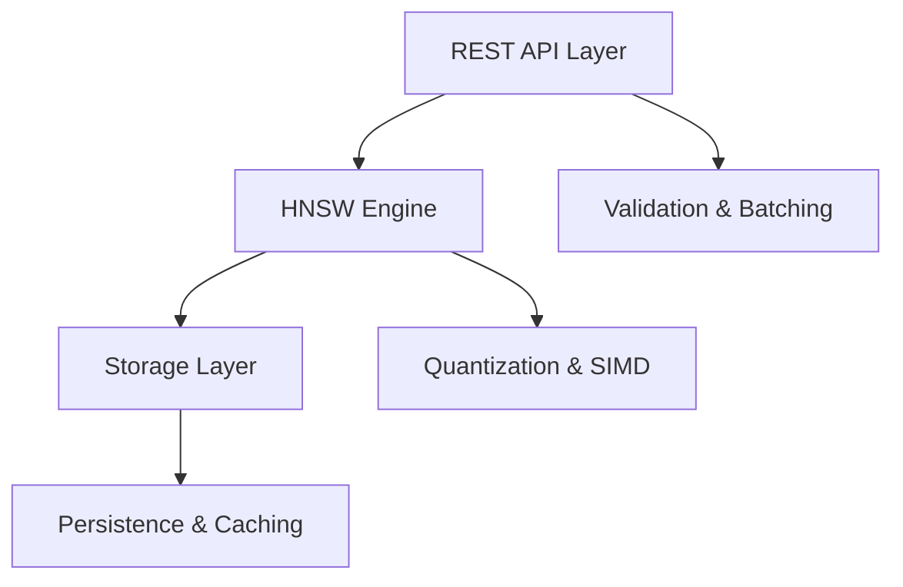

# Zyphyr

[](https://www.rust-lang.org)
[](LICENSE)
[](https://github.com/yourusername/zyphyr)

High-performance vector database built in Rust for billion-scale applications with sub-100ms search latency.

## Features

- **Sub-100ms Search** - Advanced HNSW indexing with aggressive optimizations
- **Memory Efficient** - Scalar and binary quantization reducing memory usage by 4-32x
- **Billion-Scale Ready** - Architecture designed for distributed deployment
- **Production Ready** - Async REST API with comprehensive monitoring

## Performance

| Metric | Target | Hardware |
|--------|--------|----------|
| Search Latency | <100ms | Single node |
| Vector Capacity | 100M+ vectors | 16GB RAM |
| Throughput | 1000+ QPS | Multi-threaded |
| Memory Efficiency | 4-32x reduction | Quantization |

## Quick Start

### Prerequisites
- Rust 1.70+
- 16GB+ RAM recommended
- Linux/macOS (Windows support planned)

### Installation
```bash
git clone https://github.com/vivekjami/zyphyr
cd zyphyr
cargo build --release
```

### Usage
```rust
use zyphyr::{VectorDB, Vector};

let db = VectorDB::new("./data")?;
let vector = Vector::from_slice(&[0.1, 0.2, 0.3, 0.4]);
db.insert("doc1", vector)?;

let results = db.search(&query_vector, 10)?;
```

## Development Status


**Phase 1: Core Engine** (4 weeks)
- [x] Project architecture and design
- [x] Development environment setup
- [x] Core vector data structures
- [ ] HNSW algorithm implementation
- [ ] Distance calculation optimizations
- [ ] Memory-mapped storage layer
- [ ] Basic benchmarking framework

**Phase 2: Optimization** (3 weeks)
- Quantization algorithms (scalar, binary)
- Multi-threaded search processing
- Performance tuning and profiling
- Comprehensive benchmarking

**Phase 3: Production** (3 weeks)
- REST API with batch operations
- Monitoring and observability
- Docker containerization
- Documentation and examples

## Architecture



The system consists of three main components:

**REST API Layer** - Handles requests using Axum framework with validation and batching
**HNSW Engine** - Core search algorithm with Rust implementation and quantization
**Storage Layer** - Memory-mapped files with persistence and caching

## Technical Details

### Memory Optimization
- **Scalar Quantization**: Float32 → Int8 (75% memory reduction)
- **Binary Quantization**: 32x memory reduction with <5% accuracy loss
- **Memory Mapping**: Efficient large dataset handling

### Performance Engineering
- **SIMD Instructions**: AVX2/AVX-512 vectorized operations
- **Cache Optimization**: Data structure alignment for CPU cache efficiency
- **Async I/O**: Non-blocking operations with Tokio runtime
- **Lock-free Structures**: Concurrent access without contention

### Algorithm Innovation
- **Dual-Branch HNSW**: Parallel search paths reducing local minima
- **Dynamic Parameters**: Adaptive ef values based on query patterns
- **Hierarchical Caching**: Multi-tier data access optimization

## Use Cases

**AI & Machine Learning**
- Retrieval-Augmented Generation (RAG) for LLMs
- Semantic search in knowledge bases
- Real-time recommendation systems

**Enterprise Applications**
- Document similarity and search
- Fraud detection and anomaly analysis
- Image and video content discovery

**Research & Development**
- Large-scale similarity analysis
- Scientific data clustering
- Bioinformatics sequence matching

## Benchmarks


Planned comparisons against Milvus, Weaviate, Pinecone, FAISS, and Qdrant after Phase 1 completion.

## Future Enhancements

- **Distributed Architecture**: Multi-node clustering with automatic sharding
- **Advanced Quantization**: Product quantization and learned indices
- **GPU Acceleration**: CUDA support for massive parallel processing
- **Real-time Updates**: Streaming vector ingestion
- **Enterprise Features**: Authentication, multi-tenancy, backup/restore

## Contributing

This project is in early development. Contributions welcome after Phase 1 completion.

Areas for future contribution:
- Algorithm optimizations
- Language bindings (Python, Go, JavaScript)
- Deployment automation
- Documentation improvements

## License

MIT License

## Contact

- Issues: [GitHub Issues](https://github.com/vivekjami/zyphyr/issues)
- Discussions: [GitHub Discussions](https://github.com/vivekjami/zyphyr/discussions)
